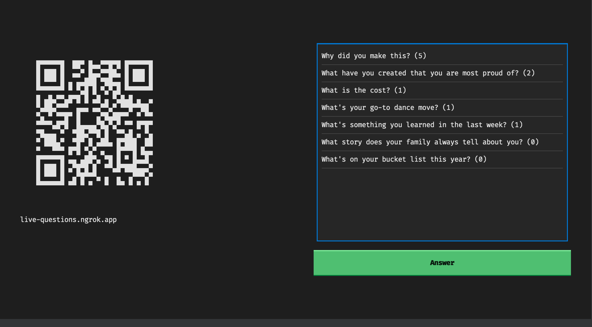
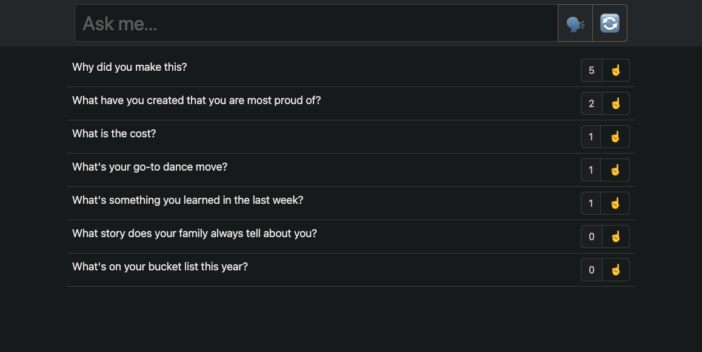

# live-questions

A live questions app using flask + ngrok + textual.

## Requirements

- [Python ^3.11](https://www.python.org/)
- [NGROK](https://ngrok.com/) configured with:
    - [Auth Token](https://dashboard.ngrok.com/get-started/your-authtoken)
    - [API Key](https://dashboard.ngrok.com/api)

## Example

